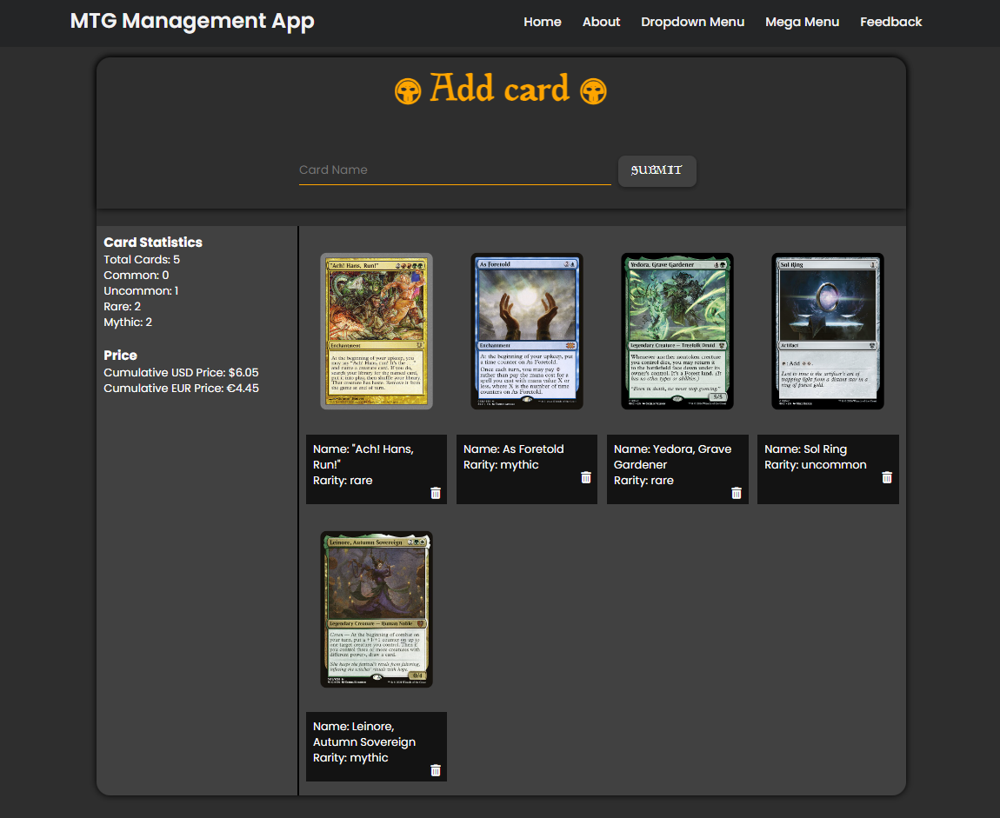
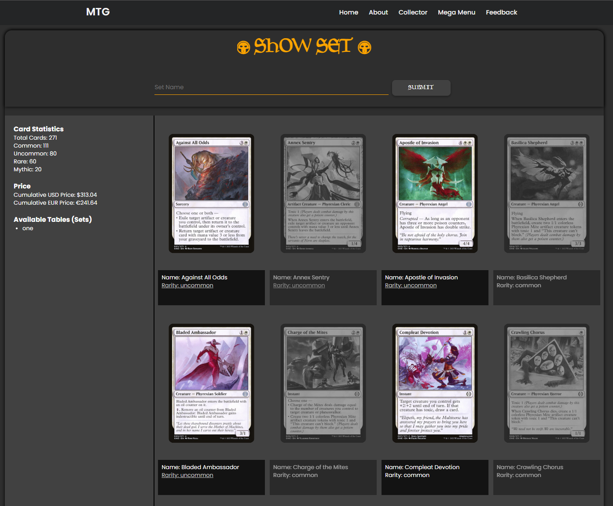

Website application written in Flask in Python 3.x.

I wanted to create a simple app that would allow me to create my own library of my cards from MTG ( Magic: The Gathering).

Current functionality:
- Simple form with card name input (with autocomplete functionality)
- Loading information of card using card name and Scryfall API
- Card gallery display with name and rarity information (data loaded from database)
- Simple statistics as total card count and rarities
- Automated data loading to database SQLite3
- Adding/Deleting cards
- Collector website, where user can download full card set and toggle card if is in possession or not

PLANNED:
- Better UX/UI
- More statistics
- Additional site for financial statistics of cards for price comparison
- Image functionality for dual sided cards
- multiple decks/databases with option to choose


USED TECHNOLOGIES:
- Python 3.12
- SQLite 3
- Flask

USED LIBRARIES:
- Flask
- Requests
- OS

USAGE:
To run application, use this command:
```
flask --app .\main.py run
```
Current outlook of webpage:



Current outlook of webpage for sets:


